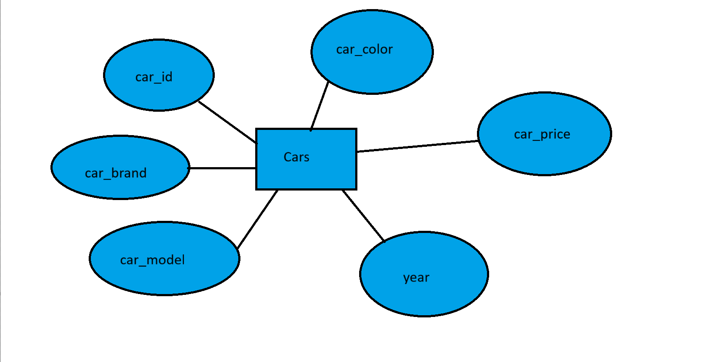
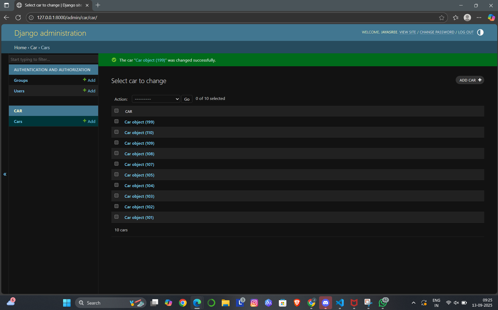

# Ex02 Django ORM Web Application
## Date: 16-09-25

## AIM
To develop a Django application to store and retrieve data from Car Inventory Database using Object Relational Mapping(ORM).

## ENTITY RELATIONSHIP DIAGRAM



## DESIGN STEPS

### STEP 1:
Clone the problem from GitHub

### STEP 2:
Create a new app in Django project

### STEP 3:
Enter the code for admin.py and models.py

### STEP 4:
Execute Django admin and create details for 10 books

## PROGRAM
```
models.py:

from django.db import models

# Create your models here.
class Car(models.Model):
    car_id=models.IntegerField(primary_key=True)
    car_brand=models.CharField(max_length=100)
    car_model=models.CharField(max_length=100)
    year=models.DateField()
    car_price=models.IntegerField()
    car_color=models.CharField(max_length=100)
    
```
```
admin.py:

from django.contrib import admin
from .models import Car
# Register your models here.
admin.site.register(Car)

class CarAdmin(admin.ModelAdmin):
    list_display=('car_id','car_brand','car_model','year','car_price','car_color')

```


## OUTPUT

Include the screenshot of your admin page.




## RESULT
Thus the program for creating a database using ORM hass been executed successfully
